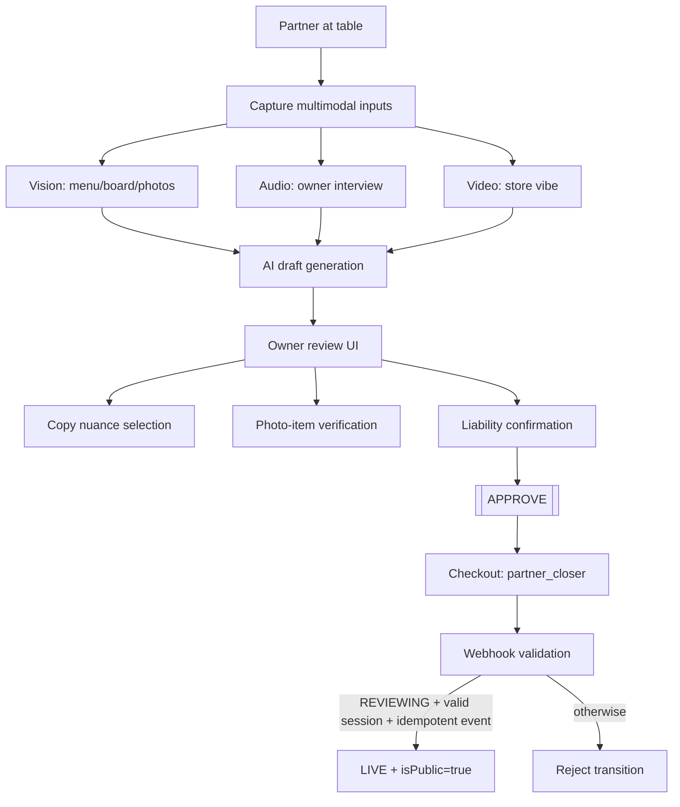

# THE ROYAL ONBOARDING (SSOT)

This document defines the canonical operator flow from partner-led ingest to store go-live.

## Flow Tree



## Runtime Mapping

- `POST /api/owner/geoBootstrap`
  - creates `stores/{storeId}` in `REVIEWING`
  - generates draft menu/drinks/soul data
  - returns `guestUrl`
- Owner review/publish API set:
  - `POST /api/owner/menuVisionImport`
  - `POST /api/owner/pairingOverrides`
  - `POST /api/owner/soulCapture`
  - `POST /api/owner/crystallize`
- Checkout:
  - `POST /api/owner/partnerClosing` (metadata: `checkoutKind=partner_closer`)
- Webhook:
  - `POST /api/billing/webhook`
  - idempotent by Stripe `event.id`
  - LIVE transition only when state guard is satisfied

## State Machine

- `CREATED`
- `GENERATING`
- `REVIEWING`
- `PAID`
- `LIVE`

Hard rule: only `REVIEWING -> LIVE` is accepted in webhook-driven activation.

## Operator Command

One-shot launcher:

```bash
OWNER_API_TOKEN=<token> LAT=35.6764 LNG=139.6500 BASE_URL=https://apicius-owner.web.app npm run ops:royal:onboarding
```

Expected output:

- `storeId=<id>`
- `guestUrl=<url>`
- `gateStatus=200` (or warning with reason)
